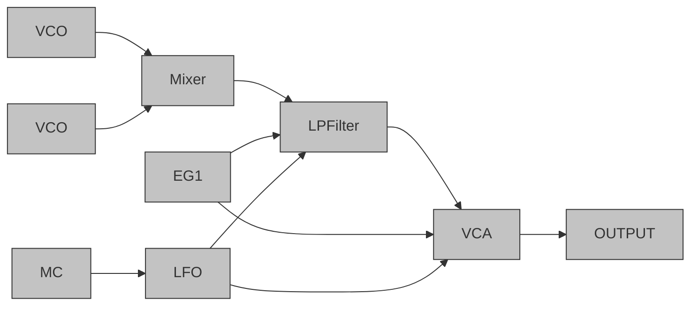

---

## Oscillators

Synthesizers are used to generate sound.  In order to do this it needs a generator of some sort, which in many cases are oscillators.

Oscillators can be compared to the vocal folds of the human voice as they serve the same function of being the mechanism or component that generates the sound.

Hardware oscillators are often called VCOs, short for Voltage Controlled Oscillators.  These oscillators, as the name suggests uses the differences between voltages to generate audio signals in the synth.

---

The four most used waveforms generated by synth oscillators are:

- Sine - A smooth "pure" sound. Round and hollow.
- Triangle - Similar to a sine but with an added bite in top-end harmonics.
- Sawtooth - Add a bit more fuzz, body and bite.
- Square - Hollow metallic and bright.

>In practice you'll load up the oscillator in your synth, crank up the level and Bob's your uncle.

---

## Filters

Filters, as you probably know from the post on audio equalization, allow you to remove frequencies from an audio signal.

---

Filters are useful in synths because it allows us to shape the sound generated by the oscillators to achieve the tone we want

---

The oscillators can create harmonically rich waveforms which you can then tame with the use of filters to produce the synth sound you want

---

We'll skip a comprehensive discussion on filters here as the main 5 types you'll use in audio synthesis are the same as the main filters used in EQs.  So, if you want to know more about filters then I suggest you read that section of the post on audio equalization

---

## Amplifiers

Amplifier or amps are circuits or components in synthesizers that allow you to adjust the gain of the synth.

---

Amps can be used in many different ways inside a synth but will usually be present near the output of the synth to control the output level.

---

The amp itself can be controlled via a direct knob or slider on the synth interface or via other processors such as controllers and envelope generators that create ADSR envelopes.

---

Controllers like MIDI keyboards send gate, or more properly note on/note off,  instructions as MIDI to the envelope generator that tells the ADSR envelope generators how to adjust the amp to create the wanted envelope or contour for the synth sound you want

---

## LFOs - Low Frequency Oscillators

LFO Icon
These oscillators aren't used to directly create audio or sound.  Instead,  these oscillators are most often used to modulate other parameters such as the oscillators that produce sound, filters and amps.  This allows for a lot of different types of modulation like sweeps and vibrato effects to mention a few.

In modern soft synths you can modulate just about any parameter with your LFOs

---

## Envelopes/ADSR

Envelopes allow you to create a contour or shape for your waveform. An envelope shapes the attack, decay, sustain and release of your synth sound.  That's why you'll sometimes see it labeled as ADSR. In soft synths envelopes can be used to automate just about any other parameter in the synth.  Yes, it's originally for amplitude automation.  but it can be just as useful for pitch for example, like when you create a synth kick that needs a fast decaying sweep to mimic a natural kick sound
---

A simple envelope has these 4 sections or controllable parameters:

Attack - The sound from where it starts to its initial highest peak or transient.
Decay - The fading of the sound from the highest peak to the sustain level.
Sustain - The level at which the sound stays as long as the note is on.
Release - The level and speed at which the sound fades to silence after the note is switched off.
Envelopes are important because most sounds in nature have envelopes when measured.  The sound doesn't just start at full amplitude and continue the same way until it suddenly just stops completely. A saw wave generated from an oscillator does just start and stop unless you apply an envelope to shape it.

Analyze a natural sound and you'll usually find it has different characteristics. It may be short or long.  It may come on fast or fade in more slowly.  It may have a high dynamic range or a low one. It could take a while to fade away after you stop the note or it could stop abruptly.

Your envelope gives you control over these characteristics of the synth sound you're creating.

You won't be wrong if you think about envelopes as a type of automation.  The parameters you set tell the envelope generator how to automate each setting to produce the curve you want.

## Putting it all together

We can construct a very basic synth patch with the components we discussed above.

It would look something like this

---

## Basic Synth Patch Diagram

Now as you can probably imagine, synth patches get much more complex than the above example.  The basic idea will always be the same.  You need something to generate the sound, i.e. the oscillator.  You need a way to shape the tone, i.e. the filters. You need a way to amplify the signal, i.e. the amp.  You can also add modulators like LFOs and envelopes to change the patch in real time as it plays back.

Now, let's take a look at some of the different types of synthesizers available today...
