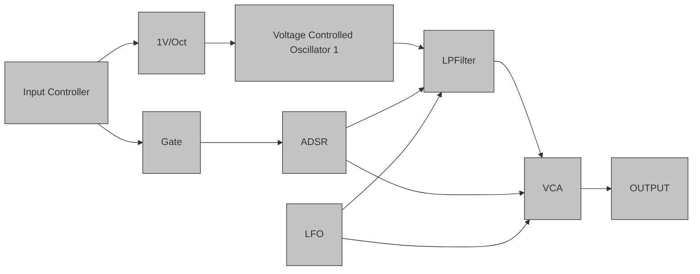

    

        
    

# Synthesis 101

An introduction to `Analog Synthesizer` basics with Chris

---

## Methods of synthesis

We have the main types. `Subtractive`, `Additive` and `FM`
today its all about subtractive synthesis

---

## Sound Generation

In order to do generate sound one need a sound generator of some sort, which in many cases are oscillators.

Oscillators can be compared to the vocal folds of the human voice as they serve the same function of being the mechanism or component that generates the sound.

> In practice you'll load up the oscillator in your synth, crank up the level and Bob's your uncle.

---

## Waveform

The four most common waveforms generated by synth oscillators are:

    

---

## Oscillator

Hardware oscillators are often called `VCOs`, short for `Voltage Controlled Oscillator`.  These oscillators, as the name suggests uses the differences between voltages to control the oscillators pitch.

---

## Controller

A controller provides signal to controls the pitch of an oscillator. For an analogue VCO this will be a 1V per octave.

---

## Trigger and Gates

A trigger is a short pulse, where a gate is how long a key is pressed, or more properly note on/off.

---

## Volume

A voltage-controlled amplifier (VCA) is an electronic amplifier that varies its gain depending on a control voltage (often CV for short).

---

## Envelopes

These allow you to create a contour or shape for your waveform.

An envelope shapes the attack, decay, sustain and release of your synth sound.  That's why you'll sometimes see it labeled as `ADSR`. In soft synths envelopes can be used to automate just about any other parameter in the synth.

// todo: Skriv denne bedre
---

## Filter

Filters, as you probably know from the post on audio equalization, allow you to remove frequencies from an audio signal.

// todo: Skriv denne bedre og ta med resonans
---

## LFO

Another type of oscillator is the `LFO`, short for `Low frequency oscillator`. These oscillators aren't used to directly create audio or sound, Instead used to modulate other parameters such as the oscillators that produce sound, filters and amps.

---

## Simple Oscillator Structure

